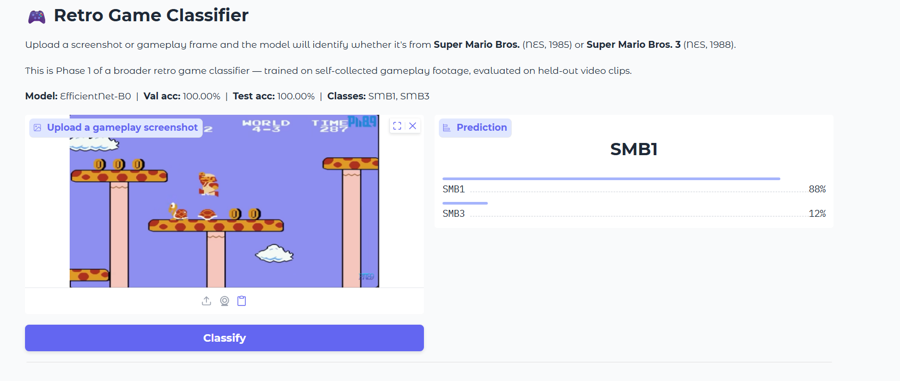

# 🎮 Retro Game Classifier

[](https://huggingface.co/spaces/rboro11/retro-game-classifier)
[](#project-phases)
[](#)
[](#)

A deep learning research project for classifying retro game screenshots using computer vision and transfer learning. Phase 1 trains and benchmarks three architectures on a binary classification task: **Super Mario Bros.** (SMB1) vs. **Super Mario Bros. 3** (SMB3).



> **Purpose:** Portfolio and research project focused on computer vision, transfer learning, and model benchmarking. Not affiliated with, endorsed by, or sponsored by Nintendo or any other game publisher.

---

## Phase 1 Results — Binary Visual Classifier (SMB1 vs SMB3)

Phase 1 trains and benchmarks three architectures on a binary screenshot classification task.

### Test Set
- **1,489 held-out frames** from two SMB3 clips (`SMB3_2_cropped`, `SMB3_4_cropped`) never seen during training
- Split is video-clip-level — no frames from the same source clip appear in both train and test
- Evaluated with `scripts/evaluate.py` against `data/processed/splits/test.csv`

### Benchmark Results

| Model | Test Accuracy | Macro F1 | Precision | Recall | Train Time |
|---|---|---|---|---|---|
| EfficientNet-B0 | **100.00%** | 1.0000 | 1.0000 | 1.0000 | 8.7 min |
| ResNet-18 | **99.80%** | 0.9980 | 0.9980 | 0.9980 | 15.8 min |
| Custom CNN (scratch) | **87.98%** | 0.8779 | 0.9025 | 0.8791 | 4.3 min |

*All models trained on a single Colab T4 GPU. Transfer models fine-tuned from ImageNet weights.*

### Per-Class Breakdown — Custom CNN

The custom CNN (trained from scratch with no pretrained weights) exposes the real difficulty of the task without ImageNet priors:

| Class | Precision | Recall | F1 | Support |
|---|---|---|---|---|
| SMB1 | 1.00 | 0.76 | 0.86 | 740 |
| SMB3 | 0.81 | 1.00 | 0.89 | 749 |

SMB1 recall at 76% reflects the model defaulting to SMB3 when uncertain — a known behavior of small from-scratch models on visually asymmetric classes. EfficientNet-B0 and ResNet-18 achieve perfect or near-perfect scores on both classes because ImageNet pretrained features transfer almost trivially to the distinct color palettes and tile art separating these two games.

### Key Takeaway
Transfer learning delivers a **12-point accuracy gain** (88% → 100%) over a custom CNN trained from scratch, with EfficientNet-B0 converging at epoch 1 in under 9 minutes — demonstrating that pretrained visual representations are highly effective even for narrow retro game classification tasks.

---

## Quick Start (Google Colab)
```bash
git clone https://github.com/rboro11/retro-game-classifier
cd retro-game-classifier
pip install -r requirements.txt
```

1. Place raw data into `data/raw/<GameName>/`
2. Run `python scripts/build_dataset.py --mode all`
3. Train a model: `python scripts/train_model.py --model resnet18 --num_classes 2 --epochs 30`
4. Benchmark all models: `python scripts/run_benchmark.py`
5. Evaluate on the held-out test set: `python scripts/evaluate.py`

### Evaluate a single model
```bash
python scripts/evaluate.py --model cnn_small
python scripts/evaluate.py --model ResNet-18
python scripts/evaluate.py --model EfficientNet-B0
```

Outputs a full classification report (accuracy, precision, recall, F1, support per class) and saves confusion matrix PNGs to `reports/`.

---

## Project Phases

| Phase | Task | Models | Status |
|---|---|---|---|
| 1 | Binary visual classifier (SMB1 vs SMB3) | Custom CNN, ResNet-18, EfficientNet-B0 | ✅ Complete |
| 2 | 3-5 game visual classifier | CNN, ResNet-18, EfficientNet-B0 | 🔜 Next |
| 3 | 10-20 game multi-era classifier | ResNet-50, EfficientNet-B3, ViT-B/16 | Planned |
| 4 | Audio classifier | Spectrogram CNN, transfer models | Planned |
| 5 | Video classifier | CNN+LSTM, 3D-ResNet | Planned |
| 6 | Multi-modal fusion | Late fusion, concat, attention | Planned |

---

## Repository Structure
```text
retro-game-classifier/
├── app.py                  # Gradio inference app (Hugging Face Spaces)
├── src/
│   ├── data/
│   │   └── dataset.py
│   ├── models/
│   │   ├── cnn_custom.py
│   │   ├── transfer_models.py
│   │   ├── temporal_models.py
│   │   ├── audio_model.py
│   │   └── fusion_model.py
│   ├── training/
│   │   └── trainer.py
│   └── evaluation/
│       └── benchmarker.py
├── scripts/
│   ├── build_dataset.py
│   ├── train_model.py
│   ├── run_benchmark.py
│   └── evaluate.py
├── configs/
│   └── config.yaml
├── exports/
│   └── EfficientNet-B0_export.pt
├── docs/
│   └── PROJECT_PLAN.md
└── requirements.txt
```

## Adding a New Class
```bash
mkdir -p data/raw/NewGameClass
cp ~/my_gameplay/*.mp4 data/raw/NewGameClass/
python scripts/build_dataset.py --mode all
python scripts/train_model.py --model resnet18 --num_classes <new_count> --epochs 30
python scripts/run_benchmark.py
python scripts/evaluate.py
```

---

## Data and Redistribution Notes
- Full datasets are not included in this repository unless redistribution is clearly permitted.
- Self-collected gameplay captures, processed training sets, and trained weights may be stored privately.
- Public documentation describes data provenance, licensing, and intended use.
- Nintendo names, characters, game titles, and related assets remain the property of their respective rights holders.

---

*Built with PyTorch · EfficientNet-B0 · Gradio · Google Colab T4 GPU*
