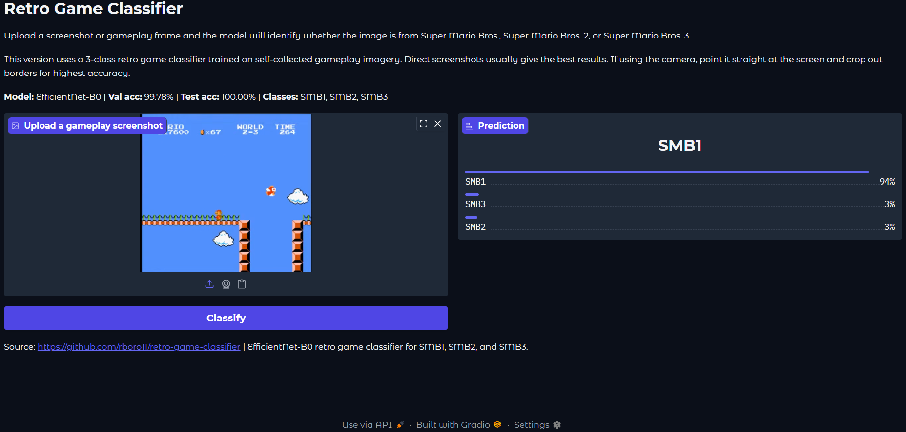

# Retro Game Classifier

A deep learning project for identifying which retro Mario game a screenshot belongs to, with the current deployed image classifier focused on **Super Mario Bros. 1, Super Mario Bros. 2, and Super Mario Bros. 3**.



## Overview

This repository contains a local-runtime workflow for building datasets, training image classifiers, evaluating results, exporting a deployment bundle, and serving predictions through a Gradio app. The current notebook pipeline mounts Drive storage, prepares local runtime paths, builds processed frame datasets, creates train/validation/test splits, trains EfficientNet-B0, evaluates it, exports the best model bundle, and prepares deployment assets for a Hugging Face Space.

The primary end-to-end notebook for the current 3-class SMB1/SMB2/SMB3 image build is `notebooks/retro_game_classifier_1v2v3.ipynb`, which implements the local-runtime-first workflow described above. Earlier notebook iterations (including the original binary SMB1-vs-SMB3 build) are preserved under `notebooks/archive/` for historical reference and baseline comparison.

## Project phases

The long-term roadmap is broader than the current 3-class image model and includes visual, audio, video, and multi-modal stages. The original project plan outlines six phases, starting from a binary screenshot classifier and expanding toward a larger multi-modal Mario identifier.

| Phase | Task | Models | Data needed |
|---|---|---|---|
| 1 | Binary NES classifier | Custom CNN | SMB1 (public) + SMB3 (your captures) |
| 2 | 3–5 game NES classifier | CNN, ResNet-18, EfficientNet-B0 | SMB1 (public) + SMB2/3 (your captures) |
| 3 | 10–20 game multi-era classifier | ResNet-50, EfficientNet-B3, ViT-B/16 | MobyGames API + your captures |
| 4 | Audio classifier | Spectrogram CNN, transfer models | NES-MDB + your OST rips |
| 5 | Video classifier | CNN+LSTM, 3D-ResNet, temporal models | NES-VMDB + your recordings |
| 6 | Multi-modal fusion | Late fusion / attention fusion | Combined image + audio + video assets |

## Current build

The latest completed build is a **3-class screenshot classifier** with labels `SMB1`, `SMB2`, and `SMB3`.The exported model bundle records the architecture as `efficientnetb0`, `numclasses` as 3, class names `SMB1`, `SMB2`, `SMB3`, and image size 224.

## Dataset and splits

The current dataset uses gameplay frames from **SMB1, SMB2, and SMB3**. SMB1 is split by gameplay session, SMB3 is split by source video clip, and SMB2 currently comes from a single **full-playthrough** source video that provides broad gameplay coverage across the game; because only one SMB2 clip was available in this build, its train/validation/test sets were created with a chronological frame-level split rather than across multiple independent clips.

After capping to 1,000 examples per class in the split builder, the resulting balanced dataset contains **2,132 training samples, 455 validation samples, and 408 test samples**.The split logs report class totals of SMB1 999, SMB2 998, and SMB3 998.

## Results

The current best model is **EfficientNet-B0** fine-tuned for 3-way image classification. The training run recorded best validation accuracy **0.9956**, early stopping at epoch 8, and a training time of about **4.7 minutes** in the benchmark summary.

On the held-out test set, the notebook reports **test accuracy 1.0000**, **macro F1 1.0000**, **macro precision 1.0000**, and **macro recall 1.0000**. The per-class evaluation shows precision, recall, and F1 of **1.00** for SMB1, SMB2, and SMB3, with supports of 148, 149, and 111 samples respectively.

## Public datasets

The broader roadmap references several public data sources for future phases, including SMB1 gameplay frames, NES-MDB for audio, NES-VMDB for video, the Super Mario Odyssey thumbnail database, and the MobyGames API for expanded screenshot coverage.

| Dataset | Modality | Link |
|---|---|---|
| SMB1 Gameplay (737k frames, CC-BY-4.0) | Images | [rafaelcp/smbdataset](https://github.com/rafaelcp/smbdataset)  |
| NES-MDB (5,278 tracks, 397 games) | Audio/MIDI | [chrisdonahue/nesmdb](https://github.com/chrisdonahue/nesmdb) |
| NES-VMDB (98,940 clips, 389 games) | Video+Audio | [arXiv 2404.04420](https://arxiv.org/abs/2404.04420) |
| SMO Thumbnail Database | Images | [Amethyst-szs/smo-thumbnail-database](https://github.com/Amethyst-szs/smo-thumbnail-database) |
| MobyGames API | Images | [mobygames.com/info/api](https://www.mobygames.com/info/api/) |

## Repository structure

The notebook references a repo structure including `app.py`, `configs/config.yaml`, `scripts/`, `src/`, `exports/`, `docs/`, and `notebooks/`.] The documented workflow uses script utilities for dataset building, benchmarking, evaluation, and video processing, including `builddataset.py`, `evaluate.py`, `runbenchmark.py`, `splicevideo.py`, and `chunksplicevideo.py`.

```text
retro-game-classifier/
├── app.py
├── configs/
├── data/
│   ├── raw/
│   └── processed/
├── docs/
│   ├── demo_screenshot.png
│   └── PROJECT_PLAN.md
├── exports/
├── notebooks/
├── scripts/
├── src/
└── requirements.txt
```

## Quick start

```bash
git clone https://github.com/rboro11/retro-game-classifier.git
cd retro-game-classifier
pip install -r requirements.txt
python scripts/builddataset.py --mode frames --fps 0.3
python scripts/builddataset.py --mode splits --max_per_class 1000
python scripts/trainmodel.py --model efficientnetb0 --numclasses 3 --epochs 20 --batchsize 32 --lr 3e-4
python scripts/evaluate.py
python scripts/exportmodel.py
```

These commands match the current notebook flow for the 3-class image build. Raw class data is organized under `data/raw/SMB1`, `data/raw/SMB2`, and `data/raw/SMB3`, with processed outputs written under `data/processed/`.

## Deployment

The notebook exports `exports/EfficientNet-B0_export.pt` together with a metadata sidecar and then prepares deployment assets for a Hugging Face Space. The newer notebook content also updates the Space app copy to reflect SMB1, SMB2, and SMB3 rather than the older binary-only wording.

The currently attached `app.py` still contains older text describing the app as an SMB1 vs SMB3 “Phase 1” classifier, so the repository app copy should be kept in sync with the current 3-class model state.
